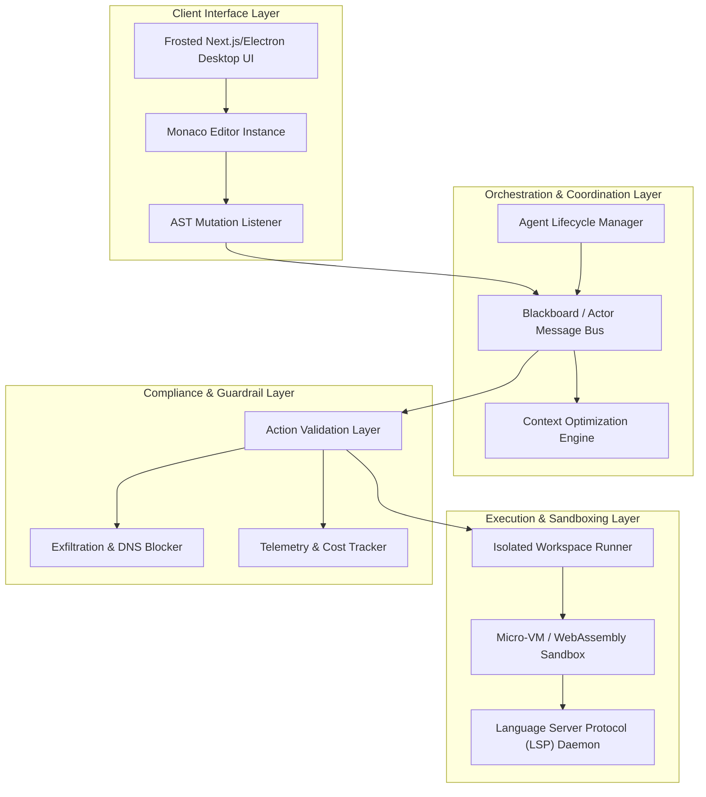
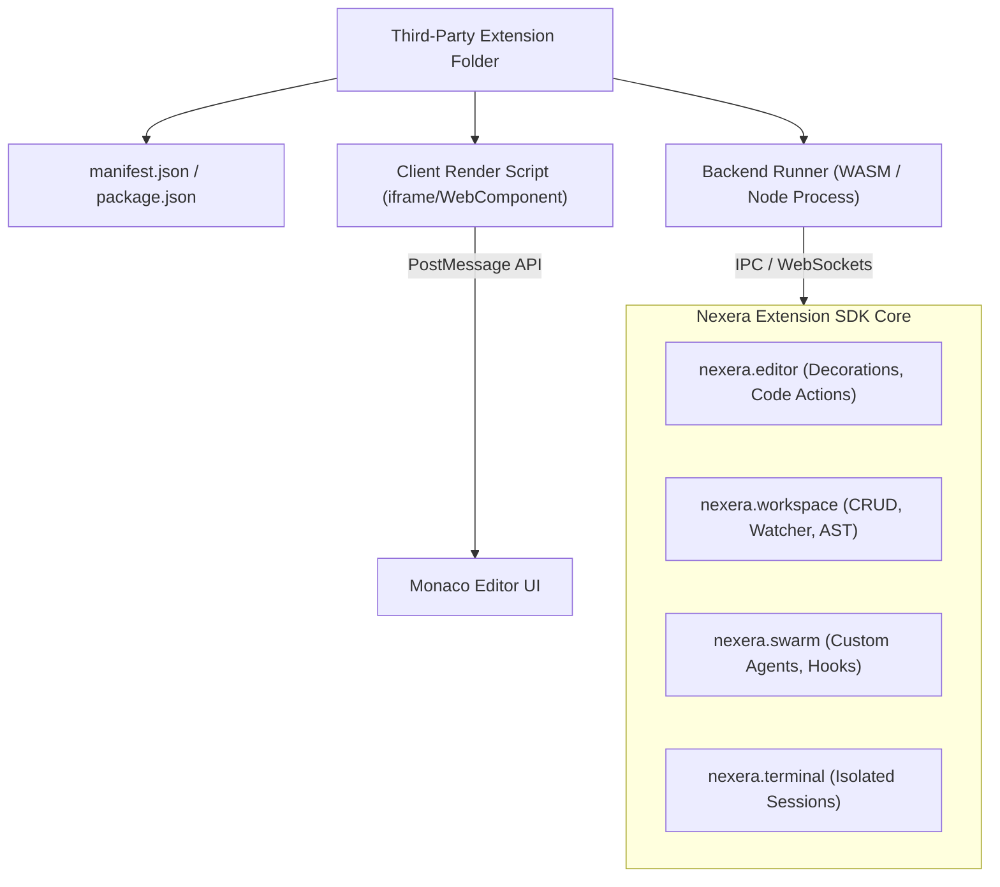

# Next-Generation Agent-First IDE: System Architecture Blueprint

This document specifies the technical design, system topologies, orchestration protocols, and guardrail schemas for building a next-generation, agent-first Interactive Development Environment (IDE) similar to **Antigravity**.

---

## 1. Core Architecture & Execution

An agent-first IDE must balance a responsive, low-latency user interface with a robust, highly isolated background runtime. The system is divided into a hybrid **Native Client Layer** and a **Headless Server Engine** communicating over asynchronous multiplexed channels.



### 1.1 Client Runtime Strategy
*   **Desktop Shell (Tauri / Rust-Native)**: While Electron provides deep system APIs, modern IDE footprints demand the lightweight efficiency of Tauri. The visual editor uses a rust-backed Tauri shell to host web-based frontend assets, utilizing Rust’s safety boundaries for OS operations.
*   **Monaco Editor Canvas**: The coding window is built using a customized Monaco Editor instance. It is coupled to a background Language Server Protocol (LSP) daemon, guaranteeing full auto-complete, diagnostics, and code-navigation while agents operate in parallel.

### 1.2 Virtual Workspace & Sandboxing Strategy
To allow developer agents to compile, run tests, and execute terminal operations safely without compromising the developer's local machine, the IDE isolates all processes:
*   **Hardware-Level Isolation (Firecracker Micro-VMs)**: The workspace runs within isolated Linux micro-VMs spawned using AWS Firecracker. 
    *   *Cold Start*: `< 5ms` start times enable seamless workspace provisioning.
    *   *Shared Files*: Workspace folders are mounted using specialized read-write `virtio-fs` drivers.
*   **WebAssembly (WASM) Isolation**: Lightweight helper agents (e.g. AST crawlers, linters) compile into WASM targets, executing at near-native speeds directly inside isolated, resource-constrained V8/Wasmtime runtimes without spawning virtual OS Kernels.

---

## 2. Multi-Agent Orchestration Engine

Agents operate as a distributed swarm, passing messages, evaluating code quality, and decomposing tasks.

```mermaid
sequenceDiagram
    autonumber
    actor User as Developer User
    participant AM as Agent Manager
    participant ActorBus as Actor Coordinator Bus
    participant CtxMgr as Context Optimizer
    participant Safety as Compliance Guardrail
    participant VM as Sandbox Micro-VM

    User->>AM: Prompt: "Refactor API and run tests"
    AM->>CtxMgr: Resolve Project Context
    CtxMgr-->>AM: Token-Optimized Code Snippets + AST Nodes
    AM->>ActorBus: Spawn Architect, Coder, Tester Actors
    
    rect rgb(22, 24, 30)
        Note over ActorBus, VM: Swarm Coordination Loop
        ActorBus->>ActorBus: Coder requests review from Tester
        ActorBus->>Safety: Coder proposes File Mutation
        Safety->>Safety: Scan command & check patterns
        Safety->>VM: Write changes & run test compiler
        VM-->>Safety: Stdout / Stderr logs
        Safety-->>ActorBus: Verification Results
    end

    ActorBus->>User: Request Review (CTO Approval Phase)
    User->>ActorBus: Approved!
    ActorBus->>VM: Commit files to Workspace Git Tree
```



### 2.1 Agent Manager Lifecycle
*   **Provisioning**: The `AgentManager` spawns worker threads as isolated Actors. Each agent possesses a unique ID, execution budget, and distinct LangChain/LangGraph role assignment.
*   **Telemetry Heartbeats**: Agents report periodic health packages (heartbeats) carrying active token burn-rates and execution durations.
*   **Termination Signals**: The manager maintains a hard kill-switch. If an agent loops infinitely, exceeds its hardware allocation, or fails validation checks, a termination signal is dispatched, recycling the micro-VM namespace instantly.

### 2.2 Actor-Based Coordination Protocol
*   **Actor Model Routing**: Agents pass structured message envelopes containing context, source files, and JSON diff payloads.
*   **Blackboard Pattern**: High-level system requirements reside in a central, thread-safe memory matrix. Specialized agents observe the blackboard state and claim tasks as they become eligible.

### 2.3 Context Window & Token Optimization
LLM context windows are easily bloated by large directories. The system optimizes the token pipeline via three stages:
1.  **Semantic Indexing**: Files are scanned into a localized vector store (e.g. SQLite-vec) containing structural interface outlines (classes, method signatures, exports).
2.  **LSP-Aided AST Pruning**: When resolving dependencies, the engine queries the AST to map exactly which files define the classes referenced in the modified code, skipping non-essential utility modules.
3.  **Dynamic Slice Budgets**: Files are parsed into small overlapping chunks. Slices undergo prompt compression (e.g., removing redundant imports and docstrings) before submission to cloud providers (Gemini, Claude, OpenAI).

---

## 3. Agent-Editor Interaction (UI/UX)

The user experience must feel fluid, eliminating the disconnect between chat-based windows and static text file outputs.

### 3.1 Real-Time AST Editor Synchronization
*   **Conflict-Free Replicated Data Types (CRDTs)**: Real-time multi-agent changes are unified using Yjs or Automerge. When an agent synthesizes code, changes appear in the Monaco editor as smooth, inline cursor typing paths.
*   **AST Anchor Binding**: Agent edit targets are bound to specific AST node signatures (e.g. `FunctionDeclaration[id.name="runAutomation"]`) rather than absolute line numbers. If the user edits line 10, the agent's staged change on line 45 adjusts cleanly without collision.

### 3.2 "Vibe Coding" Visual UX
*   **CTO Interactive Approval Gate**: Changes proposed by the swarm are staged in a side-by-side split screen showing semantic syntax-highlighted git diffs. A dedicated floating banner displays the prompt: `🛡️ CTO INTERRUPT: Approve agent commit?`
*   **Inline Prompters**: Typing `Tab` or `Ctrl + I` inline opens an interactive glassmorphic micro-prompt input box beneath the cursor, letting the developer command local swarm edits in-place.
*   **Visual Swarm Dashboard**: High-fidelity circular progress tracks, real-time pulse statuses (idle, planning, compiling, testing), and structured checklists show the active swarm plan transparently.

---

## 4. Compliance & Safety Guardrails

Because developer agents can execute terminal inputs and modify files, safety layers are critical to prevent malicious action, data exfiltration, or logical crashes.

### 4.1 Input-Output Intercept Validation
*   **Terminal Sandbox Gatekeeping**: Commands piped to terminal execution engines undergo regex parsing and execution blocks:
    *   *Blocked Commands*: `curl`, `wget`, `nc`, or standard base64/hex-obfuscated script executions are intercepted and flagged.
    *   *Path Lock*: Operations are forbidden from escaping the isolated Micro-VM workspace directory (`/workspace`).
*   **Network Isolation (Air-gapped Mode)**: Except for verified outbound LLM API provider pathways, the developer container is denied outbound internet connection, preventing exfiltration of proprietary source code.

### 4.2 Telemetry & Financial Cost Tracking
*   **Budget Ceiling Policies**: The engine calculates cumulative spending across providers using realtime pricing rates. Upon reaching user-specified cost thresholds (e.g., $5.00/hour), all swarm tasks suspend.
*   **Audit Logging**: Prompt payloads and response matrices compile in a persistent SQLite ledger (`db.sqlite3`), facilitating complete transparency and retrospective code-synthesis debugging.

---

## 5. Modular Extension API & Integration SDK Architecture

To support a growing ecosystem, the platform implements a **Universal Extension Architecture** resembling VS Code’s APIs. This permits third-party developer toolchains, custom AST compilers, visualizers, and proprietary LLM models to integrate directly into the Nexera core.



### 5.1 Extension Structure & Manifest
Each extension is structured as a standalone module containing a key definition manifest (`manifest.json`):
```json
{
  "name": "playwright-visualizer",
  "version": "1.0.0",
  "publisher": "Nexera Core",
  "engines": {
    "nexera": "^1.0.0"
  },
  "contributes": {
    "views": {
      "subsidebar": [
        { "id": "playwright-viewport", "name": "Playwright Viewport" }
      ]
    },
    "commands": [
      { "command": "playwright.runTest", "title": "Run Playwright Test Visualizer" }
    ],
    "menus": {
      "editor/context": [
        { "command": "playwright.runTest", "group": "navigation" }
      ]
    }
  },
  "main": "./dist/backend.js",
  "browser": "./dist/frontend.js"
}
```

### 5.2 The `nexera` SDK Namespace Surface
Extensions access core editor, workspace, and swarm operations using a unified, typesafe JavaScript/Python SDK namespace:

*   **`nexera.workspace`**:
    ```typescript
    // Read or write files securely
    const content = await nexera.workspace.readFile("app.py");
    // Register custom watchers to react to file system modifications
    nexera.workspace.onDidSaveTextDocument((doc) => {
      linter.evaluate(doc);
    });
    ```
*   **`nexera.editor`**:
    ```typescript
    // Add custom hover commands, inline markers, or text decorations
    nexera.editor.registerCodeActionProvider("python", {
      provideCodeActions(document, range) {
        return [{ title: "🛠️ Fix with Swarm", command: "swarm.healCode" }];
      }
    });
    ```
*   **`nexera.swarm`**:
    ```typescript
    // Register custom specialized agent nodes inside the active swarm
    nexera.swarm.registerAgent({
      id: "SecurityAuditor",
      role: "Vulnerability Scanner",
      systemPrompt: "Review code blocks for OWASP vulnerabilities...",
      onPostExecute: async (code) => {
         return scanBuffer(code);
      }
    });
    ```
*   **`nexera.terminal`**:
    ```typescript
    // Execute isolated shell tasks inside the micro-VM context
    const terminal = await nexera.terminal.createTerminal("Powershell Worker");
    terminal.sendText("pytest -v");
    ```

### 5.3 Extension Execution Sandboxing
To ensure third-party extensions do not crash the primary IDE client or compromise user file trees, the platform enforces strict separation:
*   **Decoupled Host Processes**: Extension backends run in secondary, sandboxed subprocess environments (e.g. lightweight Deno/Node isolates or WASM runtimes) carrying zero-privilege tokens.
*   **UI Sandboxing (Iframe Isolation)**: Extension visual panel components are rendered within secure, sandboxed HTML `<iframe>` viewports using restricted `sandbox="allow-scripts"` parameters, interacting with Monaco/IDE containers solely via the HTML5 `postMessage` gateway.
*   **RPC Messaging Gateway**: All calls between the host IDE process and the extension sandboxes are marshalled across an RPC JSON-WebSocket layer, maintaining a robust boundary for absolute crash resistance.

