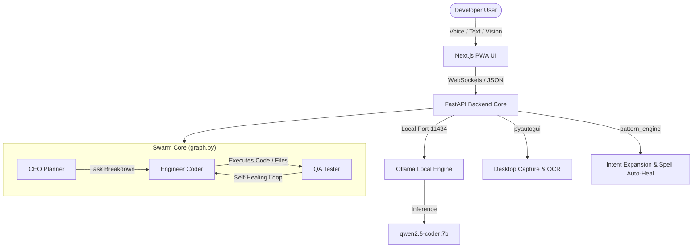

# Nexera OS: Technical Architecture Specification

This document provides a deep dive into the software architecture, agent swarm workflows, API patterns, database schemas, and hardware acceleration vectors of the Nexera developer platform.

---

## 1. Architectural Overview

Nexera uses a multi-layered local execution loop to ensure full privacy, offline capability, and low response latency. 



---

## 2. API Schema and WebSocket Operations

### 2.1 WebSockets Broadcast Gateway (`/ws`)
- **Protocol**: `ws://127.0.0.1:8000/ws`
- **Events**:
  - `{"type": "system", "message": "..."}`: System state notifications (connections, process stops).
  - `{"type": "agent", "agent": "CEO", "role": "Planning", "message": "..."}`: Swarm reasoning logs.
  - `{"type": "error", "message": "..."}`: Diagnostic errors from compilation.

### 2.2 REST Endpoints
- **GET `/api/status`**: Diagnostic health check.
- **GET `/api/screenshot`**: Triggers a PyAutoGUI snapshot, generates base64 PNG data, executes OCR text capture via pytesseract, and returns the Vision Context envelope:
  ```json
  {
    "success": true,
    "image_b64": "data:image/png;base64,...",
    "ocr_text": "Active Window OCR string",
    "error": ""
  }
  ```
- **POST `/api/start`**: Begins an active background swarm task execution.
- **POST `/api/stop`**: Aborts and cancels all background swarm threads.

### 2.3 Workspace File Operations APIs
- **GET `/api/workspace/tree`**: Recursively scans the workspace directory structure, returning a JSON array representing the hierarchical file tree.
- **POST `/api/workspace/create`**: Generates a new file or directory at the target location. Parameters: `path` (relative or absolute target path), `is_dir` (boolean).
- **POST `/api/workspace/delete`**: Safely deletes the target file or directory. Parameters: `path`.
- **POST `/api/workspace/save`**: Saves updated text content to disk. Parameters: `path`, `content`.
- **GET `/api/workspace/read`**: Loads and reads files into active editor buffers. Parameters: `path`.

### 2.4 Git Version Control APIs
- **Hosting Repository**: `https://github.com/shadman1996/Nexera-Dev.git` (Tracked branch: `master`)
- **GET `/api/git/status`**: Scans the git workspace, returning branch, modified files list, recent commits log, and workspace dirtiness status.
- **POST `/api/git/commit`**: Automatically stages all changes (`git add .`) and commits revisions with the provided commit message payload.

### 2.5 Personalization & Shorthands APIs
- **GET `/api/patterns`**: Loads registered shorthands and style analytics from user config.
- **POST `/api/patterns/shorthand`**: Configures custom intent abbreviations (e.g. `api` expands to a clean CRUD schema template).
- **POST `/api/patterns/test`**: Previews real-time intent expansion and corrects casual typos.

### 2.6 Viewport Remote Automation APIs
- **POST `/api/automation/run`**: Simulates headless Playwright browser sessions, physical clicks, and keyboard typings.

### 2.7 PowerShell Terminal WebSocket (`/ws/terminal`)
- **Protocol**: `ws://127.0.0.1:8000/ws/terminal`
- **Socket Events**:
  - `{"type": "terminal_in", "data": "cmd\n"}`: Pipes physical command/character sequences directly to the subprocess stdin stream.
  - `{"type": "terminal_reset"}`: Cleanly terminates the active powershell subprocess execution context and respawns a fresh isolated PowerShell subprocess bound to the active workspace.
  - `{"type": "terminal_out", "data": "text"}`: Streams raw stdout and stderr text back to the client interface using custom utf-8 decoding with Windows ANSI `cp1252` fallback handling to prevent unhandled loop crashes.

---

## 3. SQLite Database Schema

The async engine pool initializes SQLite databases under `./db.sqlite3` with three key persistent tables:

1. **`agent_logs`**: Logs step-by-step reasoning steps of CEO, Engineer, and QA agents.
   - Columns: `id` (Integer PK), `timestamp` (DateTime), `agent_name` (String), `action` (String), `result` (String), `phase` (String).
2. **`git_changelogs`**: Saves commit records and modified files history.
   - Columns: `id` (Integer PK), `timestamp` (DateTime), `commit_hash` (String), `message` (String), `files_changed` (JSON).
3. **`build_state`**: Stores current workspace file and compilation status states.
   - Columns: `phase` (String PK), `status` (String), `files_json` (JSON).

---

## 4. LangGraph Swarm State Nodes

### 4.1 CEO Node (Planning)
- **Role**: Decomposes high-level instructions into concrete steps.
- **Inference Pattern**: Structured numerical format parsing to prevent open-ended agent drift.
- **Robust Console Printing**: Enforces Windows Unicode stream safeguards, intercepting `UnicodeEncodeError` exceptions and translating emojis gracefully.

### 4.2 Engineer Node (Code Generation)
- **Role**: Generates pure Python source files.
- **Self-Healing Loop**: Intercepts compiler errors generated during the previous step and self-corrects.

### 4.3 QA Node (Testing)
- **Role**: Standard compiler syntax evaluation check.
- **Output**: Returns success status and precise exception stack-traces.
